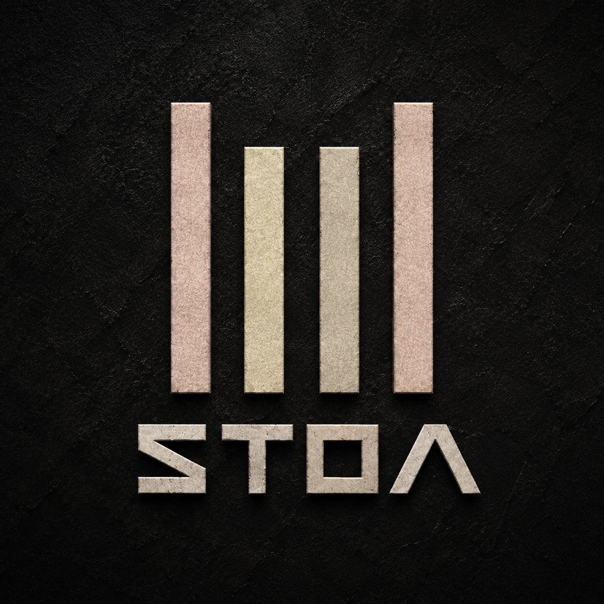

<h1 align="center">
  <br>
  
  <br>
</h1>

<p align="center">
  <b>Solana-native multi-agent swarm framework.</b><br>
  Four autonomous agents. One shared mind. Zero infrastructure.
</p>

<p align="center">
  <a href="https://github.com/stoaaadev/stoa/stargazers"></a>
  <a href="https://github.com/stoaaadev/stoa/network/members"></a>
  <a href="https://x.com/stoaframework"></a>
  <a href="https://opensource.org/licenses/MIT"></a>
  <a href="https://solana.com"></a>
</p>

<p align="center"><i>Deploy a swarm, not a dashboard.</i></p>

---

Most agent frameworks give you a single brain with tools. That works — until you need the brain to watch, think, act, and protect at the same time.

stoa is a **multi-agent swarm** where four specialized agents coordinate autonomously on Solana. Each agent has a role, a personality, and a voice. They communicate through a shared mesh. They run for free on GitHub Actions. State is git commits. Skills are markdown. Nothing to host, nothing to pay for (beyond LLM calls).

```
scout ──signal──→ analyst ──trade-signal──→ executor
  ↑                  ↑                         ↑
  └──── feedback ────┘     guardian ──halt──→───┘
                             ↓
                        protects everything
```

## Why a swarm?

| | Single-agent (solana-agent-kit, GOAT) | Off-chain swarm ($SWARMS, CrewAI) | **stoa** |
|---|---|---|---|
| Solana-native execution | Yes | No (chain-agnostic) | **Yes** |
| Multi-agent coordination | No | Yes | **Yes** |
| Role specialization | No (one agent does all) | Yes | **Yes** |
| Risk isolation | No (agent trades and monitors itself) | Partial | **Yes** (Guardian has veto) |
| Infrastructure cost | Server / API | Server / API | **$0** (GitHub Actions) |
| State persistence | External DB | External DB | **Git commits** (immutable audit trail) |
| Adding capabilities | Write code | Write code | **Write markdown** |

Single agents conflate observation with action. A single agent that both discovers opportunities and executes trades is a single point of failure with no checks. stoa separates concerns:

- **Scout** watches. It never trades.
- **Analyst** thinks. It never watches or trades.
- **Executor** acts. It never thinks independently.
- **Guardian** protects. It can override everyone.

## Quick start

```bash
# 1. Fork this repo (or use as template)
gh repo create my-stoa --template stoaaadev/stoa --private

# 2. Set secrets
gh secret set ANTHROPIC_API_KEY --body "sk-ant-..."
gh secret set SOLANA_RPC_URL --body "https://api.mainnet-beta.solana.com"
gh secret set SOLANA_PRIVATE_KEY --body "your-base58-key"  # optional: only for executor

# 3. Enable Actions
gh workflow enable tick.yml
gh workflow enable agent.yml

# 4. Done. The swarm starts on the next cron tick.
```

Or run locally:

```bash
npm install
npx stoa status              # check swarm state
npx stoa dispatch            # dry-run the dispatcher
npx stoa execute scout scan-tokens   # run one skill manually
```

## Agents

### Scout — the eyes

Continuously monitors Solana for actionable intelligence: token price movements, volume spikes, new pools, whale transactions, emerging narratives. Runs every 30 minutes.

**Skills:** `scan-tokens`, `morning-brief`

Scout never makes recommendations. It observes and reports raw signals to the mesh, letting Analyst decide what matters.

### Analyst — the brain

Evaluates Scout's signals through a scoring framework. Each signal is scored 0.0–1.0 across multiple dimensions (volume authenticity, trend momentum, narrative strength, whale track record). Only signals above the confidence threshold generate trade theses.

**Skills:** `analyze-signal`

Analyst also sends feedback to Scout on rejected signals, creating a learning loop that improves signal quality over time.

### Executor — the hands

Receives validated trade-signals from Analyst and executes them via Jupiter or Raydium. Every trade is simulated (preflight) before submission. Position sizes, slippage limits, and protocol choices are all configurable.

**Skills:** `execute-trade`

Executor is **purely reactive** — it has no cron schedule. It only runs when triggered by a message in its inbox.

### Guardian — the immune system

Monitors all open positions every 15 minutes. Enforces stop-losses, checks portfolio drawdown, flags anomalies (unusual slippage, failed transactions, unknown tokens). Guardian has **veto power**: a single `halt` message freezes the entire swarm.

**Skills:** `check-risk`

Guardian is the only agent that runs during a halt. When drawdown exceeds the configured threshold, Guardian initiates an orderly unwind and puts the swarm in cooldown.

## Skills

Skills are markdown prompts. No code. Drop a `SKILL.md` in `skills/your-skill/` and reference it in an agent's config.

```
skills/
├── scan-tokens/SKILL.md       # Token/pool/whale scanner
├── analyze-signal/SKILL.md    # Signal evaluation + trade thesis
├── execute-trade/SKILL.md     # Jupiter/Raydium swap execution
├── check-risk/SKILL.md        # Stop-loss + drawdown enforcement
└── morning-brief/SKILL.md     # Daily market summary
```

### Skill format

Every skill follows a consistent structure:

```markdown
---
name: skill-name
description: One-line purpose
tags: [category, tags]
agent: which-agent
var: what the ${var} input means for this skill
---

# skill-name

## Instructions
Step-by-step task definition with:
- Exact data sources (API URLs, memory file paths)
- Expected JSON schemas for inputs/outputs
- Priority tiers (P0/P1/P2 for multi-check skills)
- Anti-patterns (what NOT to do)
- Commit message format
```

### Adding a skill

1. Create `skills/my-skill/SKILL.md`
2. Add it to the agent's skill list in `stoa.yml`
3. Push. The agent picks it up on its next tick.

## Mesh protocol

Agents communicate asynchronously via `memory/mesh/`. Each agent has an inbox (`{agent}.json`). Messages are structured JSON:

```json
{
  "from": "scout",
  "to": "analyst",
  "type": "signal",
  "id": "scout-1716000000000-a3f2",
  "timestamp": "2026-05-18T12:00:00.000Z",
  "data": {
    "signal_type": "volume_spike",
    "token": "JUP",
    "token_address": "JUPyiwrYJFskUPiHa7hkeR8VUtAeFoSYbKedZNsDvCN",
    "details": "3.2x average volume in 1h, 847 unique traders",
    "raw_data": {}
  }
}
```

**Message types:**
| Type | From → To | Purpose |
|------|-----------|---------|
| `signal` | scout → analyst | Raw onchain observation |
| `feedback` | analyst → scout | Signal quality feedback |
| `trade-signal` | analyst → executor | Validated trade recommendation |
| `execution-report` | executor → analyst, guardian | Trade result |
| `halt` | guardian → all | Emergency stop (veto) |
| `cooldown` | guardian → all | Temporary pause |

Guardian's `halt` overrides everything. When a halt is active, only Guardian runs.

## Configuration

All swarm behavior is defined in `stoa.yml`:

```yaml
agents:
  scout:
    role: "Onchain intelligence"
    skills: [scan-tokens, morning-brief]
    schedule: "*/30 * * * *"          # every 30 min
    var:
      watch_tokens: ["SOL", "JUP", "JTO", "PYTH"]
      whale_threshold_usd: 50000

  analyst:
    skills: [analyze-signal]
    schedule: "0 * * * *"             # hourly
    triggers:
      - on: mesh
        from: scout
        type: signal                  # also runs on new signals

  executor:
    skills: [execute-trade]
    schedule: null                    # reactive only
    triggers:
      - on: mesh
        from: analyst
        type: trade-signal

  guardian:
    skills: [check-risk]
    schedule: "*/15 * * * *"          # every 15 min
    var:
      max_drawdown_pct: 15
      max_position_usd: 100
```

See `stoa.yml` for the full configuration with all options documented.

## Project structure

```
stoa/
├── stoa.yml                    # single source of truth
├── stoa.json                   # machine-readable manifest
├── CLAUDE.md                   # agent identity (auto-loaded by Claude Code)
├── README.md
├── package.json
│
├── agents/                     # agent role definitions
│   ├── scout/AGENT.md
│   ├── analyst/AGENT.md
│   ├── executor/AGENT.md
│   └── guardian/AGENT.md
│
├── skills/                     # skill prompts (markdown only)
│   ├── scan-tokens/SKILL.md
│   ├── analyze-signal/SKILL.md
│   ├── execute-trade/SKILL.md
│   ├── check-risk/SKILL.md
│   └── morning-brief/SKILL.md
│
├── src/                        # framework runtime
│   ├── index.ts                # CLI entry
│   ├── dispatch.ts             # cron dispatcher
│   ├── execute.ts              # agent executor (Claude Code bridge)
│   ├── mesh.ts                 # inter-agent message bus
│   ├── memory.ts               # shared state management
│   ├── config.ts               # stoa.yml parser
│   └── types.ts                # TypeScript definitions
│
├── memory/                     # swarm state (git-committed)
│   ├── cron-state.json         # dispatch history
│   ├── positions.json          # open trades
│   ├── portfolio-state.json    # portfolio snapshot
│   └── mesh/                   # agent inboxes
│
└── .github/workflows/
    ├── tick.yml                # cron dispatcher (every 5 min)
    └── agent.yml               # agent skill executor
```

## Cost

| Component | Cost |
|-----------|------|
| GitHub Actions | Free (2,000 min/month on free tier) |
| Claude API (Sonnet) | ~$0.01–0.05 per skill execution |
| Solana RPC | Free (public endpoints) |
| Helius API | Free tier available (optional) |
| Hosting | $0 |
| **Total fixed cost** | **$0** |

A typical swarm configuration (4 agents, ~50 skill executions/day) costs roughly **$1–3/day** in Claude API usage. GitHub Actions free tier provides ~33 hours/month — enough for continuous operation.

## Safety model

stoa implements defense-in-depth for autonomous trading:

1. **Role separation** — the agent that discovers opportunities cannot execute trades
2. **Confidence gating** — Analyst must score above threshold before generating trade-signals
3. **Guardian veto** — a single agent can freeze the entire swarm instantly
4. **Position limits** — max position size enforced in config and in Executor's skill
5. **Stop-loss enforcement** — Guardian checks every 15 minutes, independent of other agents
6. **Drawdown circuit breaker** — automatic cooldown when portfolio drawdown exceeds threshold
7. **Preflight simulation** — every transaction is simulated before submission
8. **Immutable audit trail** — all state changes are git commits with timestamps
9. **Slippage protection** — Executor aborts if actual slippage exceeds configured limit

## Adding agents

1. Create `agents/my-agent/AGENT.md` (define role, personality, responsibilities, output protocol, constraints)
2. Create skills for the agent in `skills/`
3. Add the agent to `stoa.yml` with schedule and triggers
4. Push

The dispatch system automatically picks up new agents. No code changes needed.

## FAQ

**Is this a trading bot?**
stoa is a framework for building autonomous agent swarms on Solana. The default configuration includes a trading pipeline (scout → analyst → executor → guardian), but you can replace the skills with any Solana-focused task: validator monitoring, governance participation, NFT operations, protocol analytics.

**How is this different from solana-agent-kit?**
solana-agent-kit gives a single agent tools to interact with Solana. stoa coordinates multiple agents that work together, with role specialization and risk isolation. They're complementary — stoa skills can use solana-agent-kit under the hood.

**How is this different from $SWARMS?**
$SWARMS is a Python-based general-purpose swarm framework that uses Solana only for token payments. stoa is TypeScript, Solana-native (agents execute Solana transactions), and runs on GitHub Actions instead of servers.

**Do I need to run a server?**
No. The entire swarm runs on GitHub Actions. State is git commits. There is nothing to host.

**Is my private key safe?**
Private keys are stored in GitHub Actions secrets (encrypted at rest, never logged). Only the Executor agent accesses it, and only during trade execution. If you don't configure `SOLANA_PRIVATE_KEY`, the Executor simply won't run.

**Can I run this without trading?**
Yes. Remove the Executor agent and set Guardian to monitoring-only. Scout + Analyst still produce market intelligence and signals without executing trades.

**How do I add a new Solana protocol?**
Write a new SKILL.md that references the protocol's API or SDK. Skills are markdown prompts — they tell Claude what to do, and Claude figures out the implementation.

**Can agents run different LLM models?**
Yes. Set `model:` per agent in `stoa.yml`. Scout might use Haiku (fast, cheap) while Analyst uses Opus (deep reasoning).

**What happens if an agent fails?**
The dispatcher records the failure in `cron-state.json`. Failed agents retry on the next scheduled tick. Guardian continues monitoring independently regardless of other agent failures.

**Can I fork this and customize it?**
That's the intended workflow. Fork → configure `stoa.yml` → set secrets → push. Your swarm is live.

## Philosophy

> *The Stoa Poikile was the painted porch in Athens where Zeno of Citium founded Stoic philosophy. The Stoics believed in rational agents acting within a shared logos — each autonomous, yet part of a greater order. They observed the world clearly, reasoned without emotion, acted with precision, and accepted what they could not control.*

> *stoa applies the same structure to autonomous agents on Solana. Scout observes. Analyst reasons. Executor acts. Guardian accepts nothing — and overrides everything it must.*

## License

MIT
