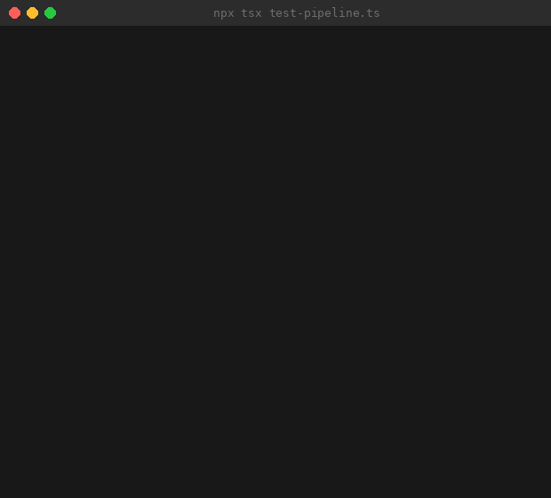

<h1 align="center">
  <br>
  
  <br>
</h1>

<p align="center">
  <b>Solana-native multi-agent swarm framework.</b><br>
  Four autonomous agents. One shared mind. Zero infrastructure.
</p>

<p align="center">
  <a href="https://github.com/stoaaadev/stoa/stargazers"></a>
  <a href="https://github.com/stoaaadev/stoa/network/members"></a>
  <a href="https://x.com/stoaframework"></a>
  <a href="https://opensource.org/licenses/MIT"></a>
  <a href="https://solana.com"></a>
</p>

<p align="center"><i>Deploy a swarm, not a dashboard.</i></p>

<p align="center">
  
</p>

---

Most agent frameworks give you a single brain with tools. That works — until you need the brain to watch, think, act, and protect at the same time.

stoa is a **multi-agent swarm** where four specialized agents coordinate autonomously on Solana. Each agent has a role, a personality, and a voice. They communicate through a shared mesh. They run for free on GitHub Actions. State is git commits. Skills are markdown. Nothing to host, nothing to pay for (beyond LLM calls).

Every execution is verified on-chain. Preflight checks block bad trades before they happen. Postflight confirms transactions actually landed. A circuit breaker halts failing skills automatically. This isn't a toy — it's a production safety stack.

```
scout ──signal──→ analyst ──trade-signal──→ executor
  ↑                  ↑                         ↑
  └──── feedback ────┘     guardian ──halt──→───┘
                             ↓
                        protects everything
```

## Why a swarm?

| | Single-agent (solana-agent-kit, GOAT) | Off-chain swarm ($SWARMS, CrewAI) | **stoa** |
|---|---|---|---|
| Solana-native execution | Yes | No (chain-agnostic) | **Yes** |
| Multi-agent coordination | No | Yes | **Yes** |
| Role specialization | No (one agent does all) | Yes | **Yes** |
| On-chain verification | No (trusts LLM output) | No | **Yes** (preflight + postflight) |
| Risk isolation | No (agent trades and monitors itself) | Partial | **Yes** (Guardian has veto) |
| Infrastructure cost | Server / API | Server / API | **$0** (GitHub Actions) |
| State persistence | External DB | External DB | **Git commits** (immutable audit trail) |
| Adding capabilities | Write code | Write code | **Write markdown** |
| LLM failover | Single provider | Single provider | **Multi-LLM gateway** (Claude → OpenAI → Gemini) |

Single agents conflate observation with action. A single agent that both discovers opportunities and executes trades is a single point of failure with no checks. stoa separates concerns:

- **Scout** watches. It never trades.
- **Analyst** thinks. It never watches or trades.
- **Executor** acts. It never thinks independently.
- **Guardian** protects. It can override everyone.

## Quick start

```bash
# 1. Fork this repo (or use as template)
gh repo create my-stoa --template stoaaadev/stoa --private

# 2. Set secrets
gh secret set ANTHROPIC_API_KEY --body "sk-ant-..."
gh secret set SOLANA_RPC_URL --body "https://api.mainnet-beta.solana.com"
gh secret set SOLANA_PRIVATE_KEY --body "your-base58-key"  # optional: only for executor

# 3. Enable Actions
gh workflow enable tick.yml
gh workflow enable agent.yml

# 4. Done. The swarm starts on the next cron tick.
```

Or run locally:

```bash
npm install
npx stoa status              # check swarm state
npx stoa dispatch            # dry-run the dispatcher
npx stoa execute scout scan-tokens   # run one skill manually
npx stoa mesh                # view mesh messages
npx stoa chain full-scan     # run a skill chain pipeline
npx stoa health              # quality scores for all agents
npx stoa cost                # token usage and cost breakdown
npx stoa gateway             # test LLM provider failover
npx stoa validate            # validate config + skill files
```

## Agents

### Scout — the eyes

Continuously monitors Solana for actionable intelligence: token price movements, volume spikes, new pools, whale transactions, liquidity changes, news sentiment, social signals. Runs every 30 minutes.

**Skills:** `scan-tokens`, `morning-brief`, `whale-tracking`, `liquidity-scan`, `news-sentiment`, `onchain-monitor`, `social-signal`

Scout never makes recommendations. It observes and reports raw signals to the mesh, letting Analyst decide what matters.

### Analyst — the brain

Evaluates Scout's signals through a scoring framework. Each signal is scored 0.0–1.0 across multiple dimensions (volume authenticity, trend momentum, narrative strength, whale track record). Runs correlation analysis, portfolio rebalancing models, and narrative tracking. Only signals above the confidence threshold generate trade theses.

**Skills:** `analyze-signal`, `correlation-analysis`, `portfolio-rebalance`, `risk-scoring`, `narrative-tracker`

Analyst also sends feedback to Scout on rejected signals, creating a learning loop that improves signal quality over time.

### Executor — the hands

Receives validated trade-signals from Analyst and executes them via Jupiter. Supports single trades, DCA execution, and stop-loss triggers. Every transaction goes through preflight checks (balance verification, circuit breaker, position limits) and postflight confirmation (on-chain tx verification).

**Skills:** `execute-trade`, `dca-execute`, `stop-loss-execute`

Executor is **purely reactive** — it has no cron schedule. It only runs when triggered by a message in its inbox.

### Guardian — the immune system

Monitors all open positions every 15 minutes. Enforces stop-losses, checks portfolio drawdown, flags anomalies, detects cost overruns, and runs self-healing routines. Guardian has **veto power**: a single `halt` message freezes the entire swarm.

**Skills:** `check-risk`, `health-check`, `self-repair`, `self-improve`, `cost-report`, `anomaly-detection`, `backup-state`

Guardian is the only agent that runs during a halt. When drawdown exceeds the configured threshold, Guardian initiates an orderly unwind and puts the swarm in cooldown. The self-repair skill automatically fixes degrading agents (3 consecutive low quality scores triggers repair).

## Skills

Skills are markdown prompts. No code. Drop a `SKILL.md` in `skills/your-skill/` and reference it in an agent's config.

```
skills/
├── scan-tokens/SKILL.md           # Token/pool scanner
├── morning-brief/SKILL.md         # Daily market summary
├── whale-tracking/SKILL.md        # Whale wallet monitoring
├── liquidity-scan/SKILL.md        # Liquidity depth analysis
├── news-sentiment/SKILL.md        # News + sentiment signals
├── onchain-monitor/SKILL.md       # On-chain activity tracker
├── social-signal/SKILL.md         # Social media signal detection
├── analyze-signal/SKILL.md        # Signal evaluation + trade thesis
├── correlation-analysis/SKILL.md  # Cross-asset correlation
├── portfolio-rebalance/SKILL.md   # Portfolio weight optimization
├── risk-scoring/SKILL.md          # Multi-factor risk assessment
├── narrative-tracker/SKILL.md     # Market narrative detection
├── execute-trade/SKILL.md         # Jupiter swap execution
├── dca-execute/SKILL.md           # Dollar-cost averaging
├── stop-loss-execute/SKILL.md     # Stop-loss trigger execution
├── check-risk/SKILL.md            # Stop-loss + drawdown enforcement
├── health-check/SKILL.md          # Swarm health assessment
├── self-repair/SKILL.md           # Auto-fix degrading skills
├── self-improve/SKILL.md          # Weekly optimization review
├── cost-report/SKILL.md           # Token usage cost analysis
├── anomaly-detection/SKILL.md     # Unusual activity detection
└── backup-state/SKILL.md          # State backup + integrity check
```

### Skill format

Every skill follows a consistent structure:

```markdown
---
name: skill-name
description: One-line purpose
tags: [category, tags]
agent: which-agent
var: what the ${var} input means for this skill
---

# skill-name

## Instructions
Step-by-step task definition with:
- Exact data sources (API URLs, memory file paths)
- Expected JSON schemas for inputs/outputs
- Priority tiers (P0/P1/P2 for multi-check skills)
- Anti-patterns (what NOT to do)
- Commit message format
```

### Adding a skill

1. Create `skills/my-skill/SKILL.md`
2. Add it to the agent's skill list in `stoa.yml`
3. Push. The agent picks it up on its next tick.

## Multi-LLM Gateway

stoa doesn't depend on a single LLM provider. The gateway (`src/gateway.ts`) implements automatic failover:

```
Claude (primary) → OpenAI (fallback) → Gemini (fallback)
```

If the primary provider returns an error or times out, the gateway transparently retries with the next provider. Each provider is configured via environment variables (`ANTHROPIC_API_KEY`, `OPENAI_API_KEY`, `GEMINI_API_KEY`). You can also set per-agent model preferences in `stoa.yml`.

## Skill Chains

Skills can be composed into pipelines with dependency graphs. A chain defines which skills run in parallel and which must wait for predecessors:

```bash
npx stoa chain full-scan          # scout scans → analyst evaluates → executor acts
npx stoa chain morning-pipeline   # morning-brief → analyze-signal → risk-scoring
npx stoa chain weekly-maintenance # health-check → self-improve → cost-report → backup-state
```

Chains are defined in `stoa.yml` and executed by `src/chain.ts`. Skills within the same stage run in parallel; stages execute sequentially.

## Preflight / Postflight

Every execution passes through safety gates:

**Preflight** (`src/preflight.ts`) — runs before skill execution:
- Halt check (is the swarm frozen?)
- Wallet balance verification (enough SOL for gas?)
- Circuit breaker (has this skill failed too many times?)
- Position limits (would this trade exceed max exposure?)

**Postflight** (`src/postflight.ts`) — runs after execution:
- On-chain transaction confirmation (did the tx actually land?)
- Signature verification via `@solana/web3.js`
- Balance delta check (did the expected token transfer happen?)

If preflight fails, the skill never runs. If postflight fails, the execution is marked as unconfirmed and Guardian is alerted.

## MCP Server

The `mcp-server/` directory contains a Model Context Protocol server that exposes the swarm as tools for Claude Desktop (or any MCP client):

| Tool | Purpose |
|------|---------|
| `stoa_status` | Current swarm state |
| `stoa_health` | Agent quality scores |
| `stoa_dispatch` | Trigger the dispatcher |
| `stoa_execute` | Run a specific agent+skill |
| `stoa_mesh_read` | Read agent inboxes |
| `stoa_mesh_post` | Post a message to the mesh |
| `stoa_positions` | View open positions |
| `stoa_cost` | Token usage breakdown |
| `stoa_chain` | Run a skill chain |
| `stoa_halt` | Emergency halt |
| `stoa_resume` | Resume from halt |
| `stoa_validate` | Validate config/skills |
| `stoa_gateway` | Test LLM failover |

Add the server to your Claude Desktop config and control the entire swarm conversationally.

## Mesh protocol

Agents communicate asynchronously via `memory/mesh/`. Each agent has an inbox (`{agent}.json`). Messages are structured JSON with TTL-based expiry and acknowledgment tracking:

```json
{
  "from": "scout",
  "to": "analyst",
  "type": "signal",
  "id": "scout-1716000000000-a3f2",
  "timestamp": "2026-05-18T12:00:00.000Z",
  "ttl": 3600,
  "data": {
    "signal_type": "volume_spike",
    "token": "JUP",
    "token_address": "JUPyiwrYJFskUPiHa7hkeR8VUtAeFoSYbKedZNsDvCN",
    "details": "3.2x average volume in 1h, 847 unique traders",
    "raw_data": {}
  }
}
```

**Message types:**
| Type | From → To | Purpose |
|------|-----------|---------|
| `signal` | scout → analyst | Raw onchain observation |
| `feedback` | analyst → scout | Signal quality feedback |
| `trade-signal` | analyst → executor | Validated trade recommendation |
| `execution-report` | executor → analyst, guardian | Trade result |
| `halt` | guardian → all | Emergency stop (veto) |
| `cooldown` | guardian → all | Temporary pause |

Messages are automatically pruned when their TTL expires. The mesh supports acknowledgment — agents mark messages as processed to prevent re-handling.

## Configuration

All swarm behavior is defined in `stoa.yml`:

```yaml
agents:
  scout:
    role: "Onchain intelligence"
    skills: [scan-tokens, morning-brief, whale-tracking, liquidity-scan,
             news-sentiment, onchain-monitor, social-signal]
    schedule: "*/30 * * * *"
    var:
      watch_tokens: ["SOL", "JUP", "JTO", "PYTH"]
      whale_threshold_usd: 50000

  analyst:
    skills: [analyze-signal, correlation-analysis, portfolio-rebalance,
             risk-scoring, narrative-tracker]
    schedule: "0 * * * *"
    triggers:
      - on: mesh
        from: scout
        type: signal

  executor:
    skills: [execute-trade, dca-execute, stop-loss-execute]
    schedule: null
    triggers:
      - on: mesh
        from: analyst
        type: trade-signal

  guardian:
    skills: [check-risk, health-check, self-repair, self-improve,
             cost-report, anomaly-detection, backup-state]
    schedule: "*/15 * * * *"
    var:
      max_drawdown_pct: 15
      max_position_usd: 100

gateway:
  primary: claude
  fallback: [openai, gemini]

chains:
  full-scan:
    stages:
      - [scan-tokens, whale-tracking, liquidity-scan]
      - [analyze-signal, correlation-analysis]
      - [execute-trade]
  morning-pipeline:
    stages:
      - [morning-brief]
      - [analyze-signal, risk-scoring]
  weekly-maintenance:
    stages:
      - [health-check]
      - [self-improve, cost-report]
      - [backup-state]
```

See `stoa.yml` for the full configuration with all options documented.

## Project structure

```
stoa/
├── stoa.yml                    # single source of truth
├── stoa.json                   # machine-readable manifest
├── CLAUDE.md                   # agent identity (auto-loaded by Claude Code)
├── README.md
├── package.json
│
├── agents/                     # agent role definitions
│   ├── scout/AGENT.md
│   ├── analyst/AGENT.md
│   ├── executor/AGENT.md
│   └── guardian/AGENT.md
│
├── skills/                     # 22 skill prompts (markdown only)
│   ├── scan-tokens/SKILL.md
│   ├── morning-brief/SKILL.md
│   ├── whale-tracking/SKILL.md
│   ├── liquidity-scan/SKILL.md
│   ├── news-sentiment/SKILL.md
│   ├── onchain-monitor/SKILL.md
│   ├── social-signal/SKILL.md
│   ├── analyze-signal/SKILL.md
│   ├── correlation-analysis/SKILL.md
│   ├── portfolio-rebalance/SKILL.md
│   ├── risk-scoring/SKILL.md
│   ├── narrative-tracker/SKILL.md
│   ├── execute-trade/SKILL.md
│   ├── dca-execute/SKILL.md
│   ├── stop-loss-execute/SKILL.md
│   ├── check-risk/SKILL.md
│   ├── health-check/SKILL.md
│   ├── self-repair/SKILL.md
│   ├── self-improve/SKILL.md
│   ├── cost-report/SKILL.md
│   ├── anomaly-detection/SKILL.md
│   └── backup-state/SKILL.md
│
├── src/                        # framework runtime (24 files, 3,687 lines)
│   ├── index.ts                # CLI entry (dispatch, execute, status, agents, mesh, chain, health, cost, gateway, validate, reset)
│   ├── dispatch.ts             # cron dispatcher with schedule + mesh trigger support
│   ├── execute.ts              # agent executor with preflight/postflight, retry, quality scoring, token tracking
│   ├── solana.ts               # @solana/web3.js integration (balance, tx verify, Jupiter swap, airdrop)
│   ├── preflight.ts            # pre-execution checks (halt, balance, circuit breaker, position limits)
│   ├── postflight.ts           # post-execution verification (on-chain tx confirmation)
│   ├── gateway.ts              # multi-LLM failover (Claude → OpenAI → Gemini)
│   ├── chain.ts                # skill chaining with dependency graph (parallel/sequential)
│   ├── mesh.ts                 # inter-agent message bus with TTL pruning, acknowledgment
│   ├── memory.ts               # git-backed state management
│   ├── config.ts               # stoa.yml parser with env var substitution
│   ├── security.ts             # tool allowlists, command denylist, prompt injection scanner
│   ├── health.ts               # quality scoring (1-5 rolling 30-run history), self-healing triggers
│   ├── tokens.ts               # token usage and cost tracking (CSV, per-agent/model breakdown)
│   ├── dedup.ts                # dispatch deduplication (prevents double-triggers)
│   ├── ratelimit.ts            # token bucket rate limiter for external APIs
│   ├── retry.ts                # exponential backoff with jitter
│   ├── validate.ts             # LLM output validation (fabrication detection, secret leak prevention)
│   ├── validate-config.ts      # config + skill file validation for CI
│   ├── wallet.ts               # wallet balance tracking
│   ├── logger.ts               # structured logging with file persistence
│   ├── types.ts                # full TypeScript type definitions
│   ├── webhook.ts              # webhook triggers for external integrations
│   └── chain-cli.ts            # chain CLI subcommand
│
├── mcp-server/                 # MCP server (13 tools for Claude Desktop)
│   └── ...
│
├── memory/                     # swarm state (git-committed)
│   ├── cron-state.json
│   ├── positions.json
│   ├── portfolio-state.json
│   ├── mesh/
│   └── ...
│
├── test-pipeline.ts            # 39 pipeline tests
├── test-devnet.ts              # Solana devnet integration tests
│
└── .github/workflows/
    ├── ci.yml                  # typecheck → test → validate → devnet integration
    ├── tick.yml                # cron dispatcher (every 5 min)
    └── agent.yml               # agent skill executor
```

## Testing

stoa has two test suites:

**Pipeline tests** (`test-pipeline.ts`) — 39 tests covering:
- Dispatch scheduling and deduplication
- Mesh message routing, TTL pruning, acknowledgment
- Preflight/postflight gate logic
- Gateway failover behavior
- Skill chain dependency resolution
- Security checks (injection detection, denylist enforcement)
- Config validation
- Health scoring and circuit breaker triggers

**Devnet integration tests** (`test-devnet.ts`) — real Solana interactions:
- Devnet connection and cluster verification
- Wallet balance queries
- Airdrop requests
- Transaction signature verification
- Jupiter quote fetching
- Preflight/postflight with live RPC

Run tests:

```bash
npx tsx test-pipeline.ts        # fast, no network
npx tsx test-devnet.ts          # requires devnet RPC
```

CI runs both automatically: `typecheck → pipeline tests → config validation → devnet integration`.

## Cost

| Component | Cost |
|-----------|------|
| GitHub Actions | Free (2,000 min/month on free tier) |
| Claude API (Sonnet) | ~$0.01–0.05 per skill execution |
| Solana RPC | Free (public endpoints) |
| Helius API | Free tier available (optional) |
| Hosting | $0 |
| **Total fixed cost** | **$0** |

A typical swarm configuration (4 agents, 22 skills, ~50 skill executions/day) costs roughly **$1–3/day** in LLM API usage. The `cost-report` skill tracks this automatically and Guardian alerts on budget overruns. Token usage is logged per-run to `memory/token-usage.csv`.

## Safety model

stoa implements defense-in-depth for autonomous trading:

1. **Role separation** — the agent that discovers opportunities cannot execute trades
2. **Preflight gates** — halt check, balance verification, circuit breaker, and position limits run before every execution
3. **Postflight verification** — on-chain transaction confirmation via `@solana/web3.js` (did the tx actually land?)
4. **Circuit breaker** — skills that fail repeatedly are automatically blocked
5. **Guardian veto** — a single agent can freeze the entire swarm instantly
6. **Confidence gating** — Analyst must score above threshold before generating trade-signals
7. **Position limits** — max position size enforced in config, preflight, and Executor's skill
8. **Stop-loss enforcement** — Guardian checks every 15 minutes, independent of other agents
9. **Drawdown circuit breaker** — automatic cooldown when portfolio drawdown exceeds threshold
10. **Multi-LLM failover** — no single provider outage can halt the swarm
11. **Output validation** — fabrication detection and secret leak prevention on all LLM outputs
12. **Prompt injection scanner** — blocks adversarial inputs before they reach execution
13. **Rate limiting** — token bucket limiter prevents API abuse
14. **Dispatch deduplication** — prevents double-triggers from race conditions
15. **Immutable audit trail** — all state changes are git commits with timestamps
16. **Self-healing** — Guardian automatically repairs degrading skills before they cause harm

## Adding agents

1. Create `agents/my-agent/AGENT.md` (define role, personality, responsibilities, output protocol, constraints)
2. Create skills for the agent in `skills/`
3. Add the agent to `stoa.yml` with schedule and triggers
4. Push

The dispatch system automatically picks up new agents. No code changes needed.

## FAQ

**Is this a trading bot?**
stoa is a framework for building autonomous agent swarms on Solana. The default configuration includes a trading pipeline (scout → analyst → executor → guardian), but you can replace the skills with any Solana-focused task: validator monitoring, governance participation, NFT operations, protocol analytics.

**How is this different from solana-agent-kit?**
solana-agent-kit gives a single agent tools to interact with Solana. stoa coordinates multiple agents that work together, with role specialization, risk isolation, and on-chain verification. They're complementary — stoa skills can use solana-agent-kit under the hood.

**How is this different from $SWARMS?**
$SWARMS is a Python-based general-purpose swarm framework that uses Solana only for token payments. stoa is TypeScript, Solana-native (agents execute and verify Solana transactions on-chain), and runs on GitHub Actions instead of servers.

**What if Claude is down?**
The multi-LLM gateway automatically fails over to OpenAI, then Gemini. Set all three API keys and the swarm keeps running regardless of any single provider outage.

**Do I need to run a server?**
No. The entire swarm runs on GitHub Actions. State is git commits. There is nothing to host. Alternatively, use the MCP server to control it from Claude Desktop.

**Is my private key safe?**
Private keys are stored in GitHub Actions secrets (encrypted at rest, never logged). Only the Executor agent accesses it, and only during trade execution. The security module includes a command denylist and prompt injection scanner to prevent exfiltration. If you don't configure `SOLANA_PRIVATE_KEY`, the Executor simply won't run.

**How does on-chain verification work?**
After Executor submits a transaction, postflight queries the Solana RPC for the transaction signature. It confirms the transaction was included in a block, checks the status for errors, and verifies the expected token transfers occurred. If verification fails, the execution is flagged and Guardian is alerted.

**Can I run this without trading?**
Yes. Remove the Executor agent and set Guardian to monitoring-only. Scout + Analyst still produce market intelligence and signals without executing trades.

**How do I add a new Solana protocol?**
Write a new SKILL.md that references the protocol's API or SDK. Skills are markdown prompts — they tell the LLM what to do, and it figures out the implementation.

**Can agents run different LLM models?**
Yes. Set `model:` per agent in `stoa.yml`. Scout might use Haiku (fast, cheap) while Analyst uses Opus (deep reasoning). The gateway handles routing.

**What happens if an agent fails?**
The dispatcher records the failure. Failed agents retry with exponential backoff on the next scheduled tick. If a skill fails 3+ times consecutively, the circuit breaker blocks it until Guardian's self-repair intervenes. Guardian continues monitoring independently regardless of other agent failures.

**What's the quality scoring system?**
Every skill execution is scored 1-5 by the health module. Scores are tracked over a rolling 30-run window. Three consecutive scores of 2 or below triggers Guardian's self-repair skill automatically.

**Can I fork this and customize it?**
That's the intended workflow. Fork → configure `stoa.yml` → set secrets → push. Your swarm is live.

## Philosophy

> *The Stoa Poikile was the painted porch in Athens where Zeno of Citium founded Stoic philosophy. The Stoics believed in rational agents acting within a shared logos — each autonomous, yet part of a greater order. They observed the world clearly, reasoned without emotion, acted with precision, and accepted what they could not control.*

> *stoa applies the same structure to autonomous agents on Solana. Scout observes. Analyst reasons. Executor acts. Guardian accepts nothing — and overrides everything it must.*

## License

MIT
